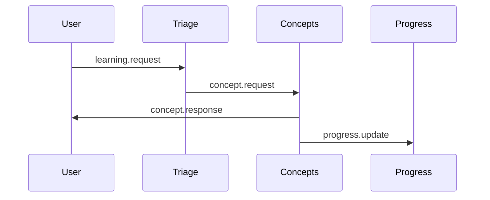

# Agents Markdown Generator - Reference Documentation

## Architecture Overview

Generates comprehensive AGENTS.md documentation from LearnFlow microservices architecture.
````
┌─────────────────────────────────────────────────────┐
│  Agent Discovery & Documentation                    │
│  ┌───────────────────────────────────────────────┐ │
│  │  1. Scan services/ directory                  │ │
│  │  2. Analyze agent.py files                    │ │
│  │  3. Extract agent types & capabilities        │ │
│  │  4. Discover Dapr components                  │ │
│  │  5. Map event topics & state stores           │ │
│  │  6. Generate architecture diagrams            │ │
│  │  7. Create AGENTS.md with full documentation  │ │
│  └───────────────────────────────────────────────┘ │
└─────────────────────────────────────────────────────┘
````

## Use Cases

### 1. Project Initialization
Generate documentation when starting LearnFlow:
````bash
cd /path/to/learnflow-app
python /path/to/skills/agents-md-gen/scripts/generate_agents_md.py
# Creates: AGENTS.md with full architecture
````

### 2. Architecture Updates
Regenerate after adding new agents:
````bash
# Add new agent to services/
python generate_agents_md.py --update
# Updates: AGENTS.md with new agent integrated
````

### 3. Documentation Review
Generate docs for code review:
````bash
python generate_agents_md.py --output docs/architecture/AGENTS.md
````

### 4. CI/CD Integration
Auto-generate on deployment:
````yaml
# .github/workflows/deploy.yml
- name: Generate AGENTS.md
  run: python scripts/generate_agents_md.py --validate
````

## Script Reference

### generate_agents_md.py
````bash
python scripts/generate_agents_md.py [OPTIONS]
````

**Options:**
- `--services-dir PATH`: Services directory (default: ./services)
- `--output PATH`: Output file path (default: ./AGENTS.md)
- `--update`: Update existing AGENTS.md
- `--validate`: Check if documentation is up-to-date
- `--format [md|html|pdf]`: Output format
- `--template PATH`: Custom template file

**Exit Codes:**
- `0`: Success
- `1`: No agents found
- `2`: Validation failed
- `3`: File I/O error

## Generated Documentation Structure

### AGENTS.md Template
````markdown
# LearnFlow Agent Architecture

## Overview
[Auto-generated summary]

## System Architecture
[ASCII diagram of all agents and connections]

## Agent Catalog

### Triage Agent
**Type:** Router
**Port:** 5000
**Dapr App ID:** triage-agent

**Input Topics:**
- learning.requests

**Output Topics:**
- concept.requests
- debug.requests
- exercise.requests

**State Keys:**
- routing_stats

**Capabilities:**
- Intent classification
- Agent routing
- Load balancing

**API Endpoints:**
- POST /process
- GET /health

---

### Concepts Agent
[Similar structure for each agent...]

## Event Flow
[Sequence diagrams for common workflows]

## State Management
[Table of all state keys and their schemas]

## Deployment Guide
[Quick start instructions]

## Troubleshooting
[Common issues and solutions]
````

## Advanced Features

### Custom Templates
````python
# custom_template.md
"""
# {{project_name}} Agents

## Agents ({{agent_count}})


### {{agent.name}}
{{agent.description}}


## Topics ({{topic_count}})

- {{topic}}

"""

# Use custom template
python generate_agents_md.py --template custom_template.md
````

### Validation Mode
````python
# Check if AGENTS.md is current
python generate_agents_md.py --validate

# Output:
# ✓ AGENTS.md is up-to-date
# OR
# ✗ AGENTS.md is outdated (3 new agents detected)
#   Run without --validate to update
````

### HTML Export
````bash
python generate_agents_md.py --format html --output docs/agents.html
````

### PDF Export (requires pandoc)
````bash
python generate_agents_md.py --format pdf --output AGENTS.pdf
````

## Detection Logic

### Agent Discovery
````python
def discover_agents(services_dir: Path) -> list:
    """Find all agent directories."""
    agents = []
    
    for service_dir in services_dir.iterdir():
        agent_file = service_dir / "agent.py"
        if agent_file.exists():
            agent_info = parse_agent(agent_file)
            agents.append(agent_info)
    
    return agents
````

### Agent Parsing
````python
def parse_agent(agent_file: Path) -> dict:
    """Extract agent metadata from source."""
    with open(agent_file) as f:
        source = f.read()
    
    # Parse with AST
    tree = ast.parse(source)
    
    return {
        'name': extract_name(tree),
        'type': extract_type(tree),
        'topics': extract_topics(tree),
        'capabilities': extract_capabilities(tree),
        'tools': extract_tools(tree),
    }
````

### Topic Extraction
````python
def extract_topics(tree: ast.AST) -> dict:
    """Find pub/sub topics in agent code."""
    topics = {'input': [], 'output': []}
    
    for node in ast.walk(tree):
        # Find publish_event calls
        if isinstance(node, ast.Call):
            if hasattr(node.func, 'attr') and node.func.attr == 'publish_event':
                topic = get_topic_arg(node)
                topics['output'].append(topic)
        
        # Find subscribe decorators
        if isinstance(node, ast.FunctionDef):
            for decorator in node.decorator_list:
                if is_subscribe_decorator(decorator):
                    topic = get_decorator_topic(decorator)
                    topics['input'].append(topic)
    
    return topics
````

## Architecture Diagrams

### System Overview (ASCII)
````
python generate_agents_md.py
````

Generates:
````
                      ┌──────────────┐
                      │   Frontend   │
                      └───────┬──────┘
                              │
                              ▼
                      ┌──────────────┐
                      │    Triage    │
                      └───┬────┬────┬┘
                          │    │    │
           ┌──────────────┘    │    └──────────────┐
           │                   │                   │
           ▼                   ▼                   ▼
    ┌──────────┐        ┌──────────┐      ┌──────────┐
    │ Concepts │        │  Debug   │      │ Exercise │
    └──────────┘        └──────────┘      └──────────┘
           │                   │                   │
           └───────────────────┴───────────────────┘
                              │
                              ▼
                      ┌──────────────┐
                      │   Progress   │
                      └──────────────┘
````

### Event Flow (Mermaid)
````bash
python generate_agents_md.py --include-mermaid
````

Generates:
````markdown

````

## Integration Examples

### FastAPI Endpoint
````python
from fastapi import FastAPI
from pathlib import Path
import generate_agents_md

app = FastAPI()

@app.get("/docs/agents")
async def get_agents_doc():
    """Return AGENTS.md content."""
    agents_md = Path("AGENTS.md")
    if not agents_md.exists():
        generate_agents_md.main(["--output", str(agents_md)])
    
    return {"content": agents_md.read_text()}

@app.post("/docs/agents/regenerate")
async def regenerate_agents_doc():
    """Force regeneration of AGENTS.md."""
    generate_agents_md.main(["--update"])
    return {"status": "regenerated"}
````

### Pre-commit Hook
````bash
#!/bin/bash
# .git/hooks/pre-commit

echo "Updating AGENTS.md..."
python scripts/generate_agents_md.py --update

if git diff --quiet AGENTS.md; then
    echo "✓ AGENTS.md up-to-date"
else
    git add AGENTS.md
    echo "✓ AGENTS.md updated and staged"
fi
````

### CI Validation
````yaml
# .github/workflows/validate.yml
name: Validate Documentation

on: [pull_request]

jobs:
  validate-agents-md:
    runs-on: ubuntu-latest
    steps:
      - uses: actions/checkout@v3
      
      - name: Setup Python
        uses: actions/setup-python@v4
        with:
          python-version: '3.11'
      
      - name: Validate AGENTS.md
        run: |
          python scripts/generate_agents_md.py --validate
          if [ $? -ne 0 ]; then
            echo "AGENTS.md is outdated. Run 'python scripts/generate_agents_md.py --update'"
            exit 1
          fi
````

## Troubleshooting

### No Agents Found
**Symptom:** Script exits with "No agents found"

**Diagnosis:**
````bash
python generate_agents_md.py --debug
````

**Solutions:**
1. Verify services/ directory exists
2. Check agent.py files exist in subdirectories
3. Ensure proper directory structure:
````
   services/
   ├── triage/
   │   └── agent.py
   ├── concepts/
   │   └── agent.py
````

### Parse Errors
**Symptom:** "Failed to parse agent.py"

**Diagnosis:**
````bash
python -m py_compile services/triage/agent.py
````

**Solution:**
Fix syntax errors in agent files

### Missing Topics
**Symptom:** Topics not detected in AGENTS.md

**Diagnosis:**
Check topic names match pattern:
````python
# This works
client.publish_event(topic_name="concept.requests", ...)

# This doesn't (dynamic topic)
topic = f"{prefix}.requests"
client.publish_event(topic_name=topic, ...)
````

**Solution:**
Use literal strings for topic names

## References

- [Python AST Module](https://docs.python.org/3/library/ast.html)
- [Markdown Specification](https://spec.commonmark.org/)
- [Mermaid Diagrams](https://mermaid-js.github.io/)
- [Jinja2 Templates](https://jinja.palletsprojects.com/)
